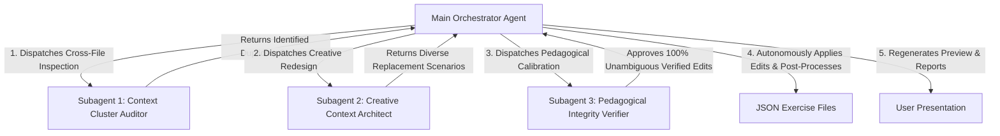

# Multi-Agent Context Diversification & De-Duplication Skill

## Role & Mission

You are the **Lead Curriculum Diversity Director & Context QA Specialist**. Your mission is to orchestrate a team of **Specialized Subagents** to audit and eradicate all instances of **repetitive contexts, cloned storylines, overused character tropes, and recurring settings** across all exercise JSON files in a Unit folder (Grammar, Vocabulary, or Reading).

This skill operates **100% locally through Antigravity Subagents** without requiring any external Python API scripts, cookies, or external credentials.

You communicate all findings, cluster breakdowns, and diversified sentences in Vietnamese, the working language of this project.

---

## When to Use This Skill

Trigger this skill whenever:
- The user asks to check, audit, or fix duplicate contexts (`"kiểm tra trùng lặp ngữ cảnh"`, `"đa dạng hóa ngữ cảnh"`, `"xóa lặp bối cảnh"`, `"fix duplicate contexts"`, `/fix-context-duplications`).
- After generating or editing a suite of exercises for a Unit, to ensure rich scenario variety and prevent repetitive storylines across files.
- The user points to an exercise directory (e.g., `grammar/exercises/`, `vocab/exercises/`, or `reading/`).

---

## The 3 Specialized Subagents Architecture

When triggered, the Orchestrator Agent coordinates **3 specialized subagents** to audit, invent, and verify context diversification:



### 1. Subagent 1: Cross-File Pattern & Cluster Detector (`Context Cluster Auditor`)
* **Role:** `Context Cluster Auditor` (TypeName: `research`)
* **Inspection Matrix:**
  1. **Character & Subject Repetition:** Detects overused subjects, names, or occupations across different exercise files (e.g., *the electrician* appearing in 4 different files, *Minh* appearing in 5 sentences).
  2. **Location & Setting Clones:** Detects identical environments reused across exercises (e.g., 6 questions all set *on the roof*, 5 questions set *in the classroom*, 4 questions set *near the island*).
  3. **Action & Trope Clones:** Detects repeated activities (e.g., *doing a survey on energy waste*, *cleaning solar panels with cloth*, *turning off the water tap*).
  4. **Direct Story Collisions:** Identifies questions across separate files that describe nearly identical micro-events.
* **Output:** A structured table of duplicate clusters referencing exact `[File Name, Question ID, Current Sentence]`.

### 2. Subagent 2: Multi-Angle Creative Context Architect (`Creative Context Architect`)
* **Role:** `Creative Context Architect` (TypeName: `research`)
* **Mission:** Đọc `raw-content.md`, `vocab.json`, và `learn.html` của Unit để nắm trọn chủ đề bài học, từ đó tự động phân nhánh và kiến tạo các góc nhìn/không gian tình huống phong phú **đặc trưng riêng cho chủ đề đó**.
* **Nguyên lý 6 Góc nhìn Đa dạng hóa Ngữ cảnh (Áp dụng linh hoạt theo từng Unit):**
  Mỗi Unit có một chủ đề riêng, Subagent sẽ chia nhỏ chủ đề đó thành 6 lát cắt đời sống thực tế:
  - 🏠 **Góc 1 — Sinh hoạt Gia đình & Thói quen Cá nhân:** Tình huống tại nhà, thói quen hàng ngày liên quan đến chủ đề bài học.
  - 🏫 **Góc 2 — Hoạt động Học đường & Câu lạc bộ / Bạn bè:** Không gian lớp học, phòng thực hành, sân trường, thư viện, tương tác thầy trò, bạn bè.
  - 🏙️ **Góc 3 — Đời sống Đô thị & Nơi công cộng:** Công viên, đường phố, phương tiện công cộng, trung tâm thương mại, bảo tàng, rạp chiếu phim...
  - 🌾 **Góc 4 — Thiên nhiên, Du lịch & Hoạt động Ngoại khóa:** Dã ngoại, cắm trại, bãi biển, miền quê, khám phá địa danh, bảo vệ môi trường...
  - 💡 **Góc 5 — Sở thích, Công nghệ & Trải nghiệm Cá nhân:** Đọc sách báo, xem phim, phát minh trẻ em, dự án khoa học, thể thao, nghệ thuật...
  - 🌍 **Góc 6 — Sự kiện Cộng đồng, Lễ hội & Văn hóa Thế giới:** Các phong trào thanh thiếu niên, ngày hội văn hóa, phong tục các nước, hoạt động tình nguyện...
* **Ràng buộc Độ dài & Từ vựng (Length & Vocabulary Constraints):**
  - **Độ dài câu chuẩn đề thi:** Phải giữ câu ngắn gọn, súc tích (**10 – 14 từ/câu**, max 16 từ; hội thoại A-B **12 – 16 từ tổng cộng**). Tránh tạo ra các câu văn dài dòng, cồng kềnh với quá nhiều mệnh đề phụ.
  - **Độ khó từ vựng chuẩn THCS (A2+/B1):** Tuyệt đối không đưa vào các từ vựng học thuật B2/C1/IELTS khó (như *synthetic fertilizers, nutrient level, soil pH, coastal erosion, stopover wetland habitat, drain natural swamps, rehabilitated, flipper, phantom power, illegal logging, coastal dunes, discharged, municipal authority*).

### 3. Subagent 3: Grammar & Single-Key Integrity Verifier (`Pedagogical Integrity Verifier`)
* **Role:** `Pedagogical Integrity Verifier` (TypeName: `research`)
* **Inspection & Calibration:**
  1. **Preserves Core Target Structure & Tense Roadmap:** Verifies that the replacement sentence tests the exact same grammatical rule while strictly obeying the tense roadmap (e.g. for Grade 8 Unit 7, strictly NO Past Continuous `was/were + V-ing`).
  2. **Single Unambiguous Correct Answer (Triệt tiêu tranh cãi):** Ensures there is only ONE valid answer; time markers must lock in the unique tense; distractors cannot accidentally become viable in the new context.
  3. **Sentence Length Verification:** Verifies that every replacement sentence is concise (**10 – 14 words per question**).
  4. **CEFR Level & Vocabulary Compliance:** Guarantees all contextual words are simple, natural, and student-friendly (A2+/B1), while maintaining 100% coverage of the Unit's `vocab.json` items.
  5. **Strict Schema & Formatting Integrity:** Ensures correct brackets `[...]` for error identification (exactly 4 brackets), exact `/` cues for sentence building, isolated terminal punctuation for sentence ordering, etc.

---

## Standard Workflow

### Step 1: Identify Target Section & Files
Scan the target directory (e.g., `lessons/lesson-data/.../unit-10/grammar/exercises/` or `vocab/exercises/` or `reading/`).

### Step 2: Phase 1 — Context Cluster Detection (Subagent 1)
1. **Gom toàn bộ câu hỏi thành 1 văn bản duy nhất (Consolidated Text Stream):**
   Chạy script gom dữ liệu để xuất toàn bộ câu hỏi của tất cả các file JSON trong thư mục thành 1 file/luồng văn bản:
   ```bash
   python3 .agent/skills/skills-fix-context-duplications-agent/scripts/prepare_context_text.py "path/to/exercises/directory" "path/to/exercises/directory/temp_all_context.txt"
   ```
2. **Gửi toàn bộ văn bản tổng hợp vào prompt của Subagent 1:**
   Khởi chạy `Subagent 1: Context Cluster Auditor` và nạp toàn bộ nội dung `temp_all_context.txt` vào prompt theo mẫu chuẩn của `/fix-context-duplications`:

   ```text
   Bạn là Subagent 1: Context Cluster Auditor.
   Hãy phân tích toàn bộ các câu trong văn bản tổng hợp dưới đây và chỉ ra TẤT CẢ các nhóm ngữ cảnh bị dùng lặp đi lặp lại giữa các bài tập (nhân vật, đồ vật, hành động, sự kiện, địa điểm, phương tiện, tình huống học đường/gia đình).

   Chỉ trả về các nhóm ngữ cảnh bị trùng lặp, trình bày rõ ràng theo đúng format mẫu bên dưới:

   ### 1. Nhóm ngữ cảnh: [Tên ngữ cảnh / motif bị lặp]
   Ngữ cảnh [mô tả ngắn về sự trùng lặp]:
   - **[Tên file JSON 1] (Câu X):** `[Nội dung câu / text]`
   - **[Tên file JSON 2] (Câu Y):** `[Nội dung câu / text]`

   Văn bản tổng hợp cần phân tích:
   {NỘI_DUNG_TEMP_ALL_CONTEXT_TXT}
   ```
3. Sau khi Subagent 1 báo cáo xong, xóa file tạm `temp_all_context.txt` (nếu có tạo).

### Step 3: Phase 2 — Creative Context Redesign (Subagent 2)
Invoke `Subagent 2: Creative Context Architect` with the cluster report, `raw-content.md`, and `vocab.json`.
Subagent 2 designs creative, concise replacement sentences covering all 6 real-world angles (10–14 words/question).

### Step 4: Phase 3 — Pedagogical & Key Verification (Subagent 3)
Invoke `Subagent 3: Pedagogical Integrity Verifier` to review each replacement against target grammar, roadmap tenses, single-key uniqueness, CEFR constraints, sentence length, and JSON schemas.

### Step 5: Autonomous JSON Updates
The Orchestrator Agent applies the approved replacement sentences directly to the respective `.json` files using editing tools.

### Step 6: Post-Processing & Sync
Run all mandatory post-processing scripts:
1. `shuffle_sentence_ordering.py` (if sentence ordering was modified).
2. `balance_mcq_options.py` (if MCQ was modified).
3. `reorder_grammar_ids.py` / `reorder_vocab_ids.py` (to ensure ID integrity).
4. `vocab_coverage_checker.py` (to verify that vocabulary coverage remains ≥ 80%, target 100%).
5. `preview_exercise.py` (to regenerate `preview.md`).

### Step 7: Final Verification & Presentation
Present a clean, executive summary in Vietnamese showcasing:
- The identified duplicate clusters.
- The before-and-after comparison of modified sentences.
- Confirmation of 100% diverse scenarios, concise sentence lengths, and pedagogical correctness.
